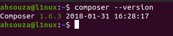
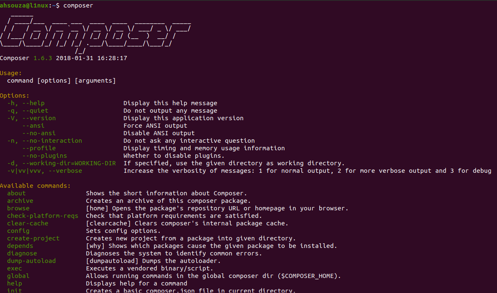
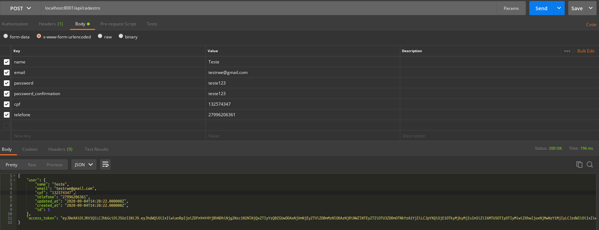
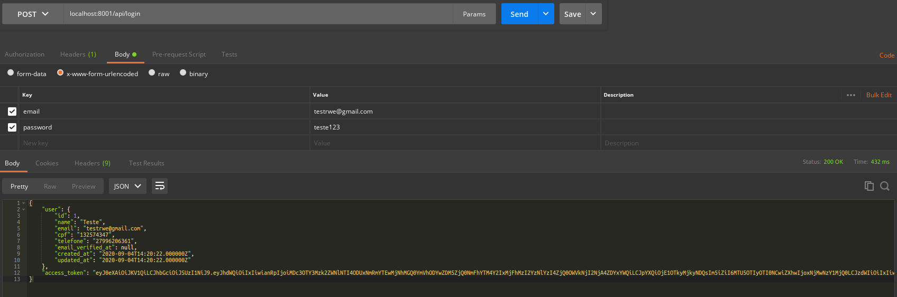
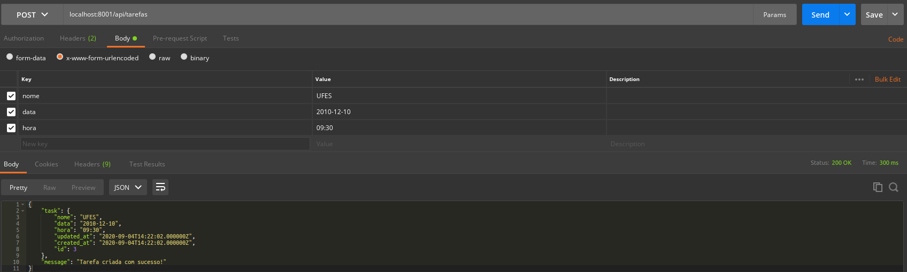
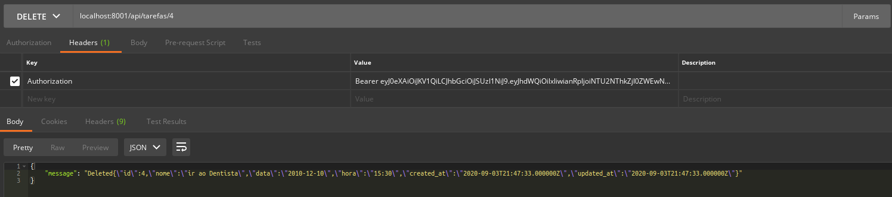

# desafio-minha-agenda
Desafio em processo seletivo para vaga desenvolvedor back-end


Para termos o Laravel instalado em nossa máquina Windows, é necessário ter o **PHP com a versão 7.2 no mínimo** e gerenciador de dependências **Composer**.

Simplificaremos cada etapa da construção de uma **API** enviando solicitações **REST**, **SOAP** e **GraphQL**, vamos utilizar o **POSTMAN**.

E para gerenciarmos as versões no desenvolvimento do Software com **GIT**, vamos utilizar o modelo de ramificação rigoroso com **GIT FLOW**.


###### Pré-Requisitos no Windows

- PowerShell [Download 64 Bit](https://github.com/PowerShell/PowerShell/releases/download/v7.0.3/PowerShell-7.0.3-win-x64.zip) [Download 32 Bit](https://github.com/PowerShell/PowerShell/releases/download/v7.0.3/PowerShell-7.0.3-win-x86.zip)
- Sublime Text 3 [Download](https://www.sublimetext.com/3)| VS Code [Download](https://code.visualstudio.com/download)| Atom [Download 64 Bit](https://github.com/atom/atom/releases/download/v1.50.0/AtomSetup-x64.exe) [Download 32 Bit](https://github.com/atom/atom/releases/download/v1.50.0/AtomSetup.exe)
- Git [Download](https://git-scm.com/downloads)
- PHP 7.2 no mínimo [Download](https://windows.php.net/download/)
- Composer [Download](https://getcomposer.org/)
- Postman [Download](https://www.postman.com/downloads/)


Após concluir a instalaçao do **PHP & Composer** em sua máquina, faça um teste para saber se está ocorrendo tudo bem com o gerenciador de dependências em seu computador:

```cmd
composer --version
```


Veja a lista de comandos que o Composer fornece com o seguinte comando:

```cmd
composer
```



Com **GIT** instalado em sua máquina [Baixe](https://github.com/ahsouza/desafio-minha-agenda/archive/master.zip) ou clone o repositório

```sh
git@github.com:ahsouza/desafio-minha-agenda.git
https://github.com/ahsouza/desafio-minha-agenda.git
```

Baixe o projeto em seu diretório, entre na pasta **desafio-minha-agenda** e faça a instalação das dependências com **Composer**

```sh
composer install
```
Após concluir as instalações das dependências, crie um arquivo com o nome de **database.sqlite** em `database\` que está na estrutura de pastas e arquivos do projeto Laravel PHP

Faça a migração das tabelas com o seguinte comando:

```sh
php artisan migrate
```
Execute o servidor

```sh
php artisan serve
```

Com o **POSTMAN** instalado, faça as solicitações de chamadas **HTTP** da **API** minha agenda e não se esqueça de fazer login com `usuários autenticados` e atribuir seu **Token** no cabeçalho da requisição que depende dos usuários autenticados para ter acesso

## Endpoints

  - [POST /api/cadastro](#cadastro-usuario)
  - [POST /api/login](#login-usuario)
  - [GET /api/tarefas](#retornar-tarefas)
  - [POST /api/tarefas](#registrar-tarefa)
  - [DELETE /api/tarefas/{id}](#excluir-tarefa)


## Cadastro Usuario

#### POST /api/cadastro
Cadastro para usuários

```bash
https://localhost:8000/api/cadastro
```
###### Query Params

Exemplo de paramêtros em JSON

```js
{
	"name": "test",
  "email": "test@test.com",
  "password": "test",
  "password_confirmation": "test",
  "cpf": "00000000000",
  "telefone": "0000000000"
}
```



## Login Usuario

#### POST /api/login
Login para usuários

```bash
https://localhost:8000/api/login
```


###### Query Params

Exemplo de paramêtros em JSON

```js
{
  "email": "test@test.com",
  "password": "test"
}
```


## Retornar Tarefas

#### GET /api/tarefas
Retorne todas as tarefas

```bash
https://localhost:8000/api/tarefas
```


## Registrar Tarefa

#### POST /api/tarefas
Salvando nova tarefa

```bash
https://localhost:8000/api/tarefas
```



###### Query Params

Exemplo de paramêtros em JSON

```js
{
  "nome": "Aprender Laravel",
  "data": "2020-10-08",
  "hora": "09:30"
}
```

## Excluir Tarefa

#### POST /api/tarefas/{id}
Deletando tarefa

```bash
https://localhost:8000/api/tarefas/{id}
```

